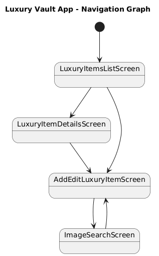
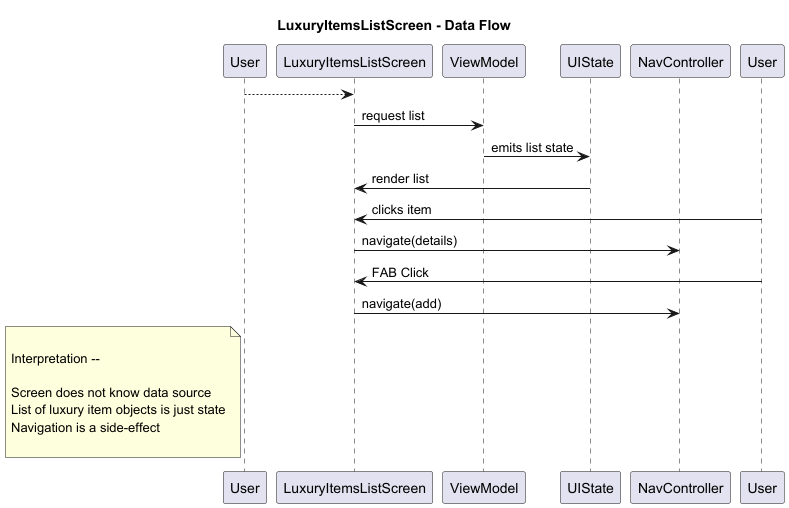
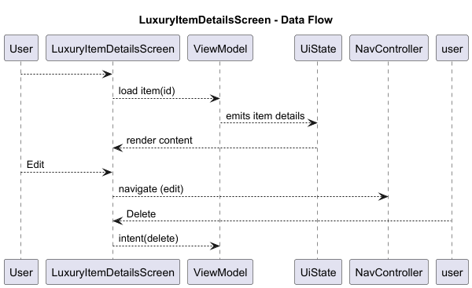
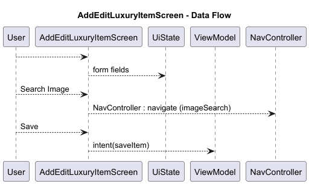
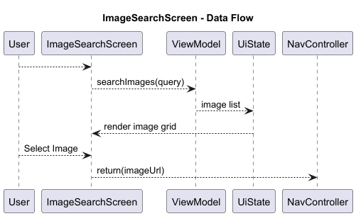

# Phase 01 — Dumb UI Screens

What we are doing here :

- Layout structure
- State → UI mapping
- Click callbacks
- Empty / loading / error visuals

How we test
- Manual interaction
- Compose Preview
- Fake state injection

What we are not testing (correctly)

- Navigation correctness
- Business rules
- Data persistence
 
- This phase eliminates flaky UI tests later because UI contracts are frozen early.
- Covers: UI Contract Testing

## Flow of Navigation and Data (Diagrams)

---

---

---

---

---

## Importance of Keeping Screens "Dumb"

A dumb screen means

- Receives UiState
- Emits UiEvent

Has NO IDEA about:

- Room
- Retrofit
- Hilt
- Repository
- UseCases

This guarantees:

- Easy UI testing
- Minimal or zero refactor later
- Compose previews work
